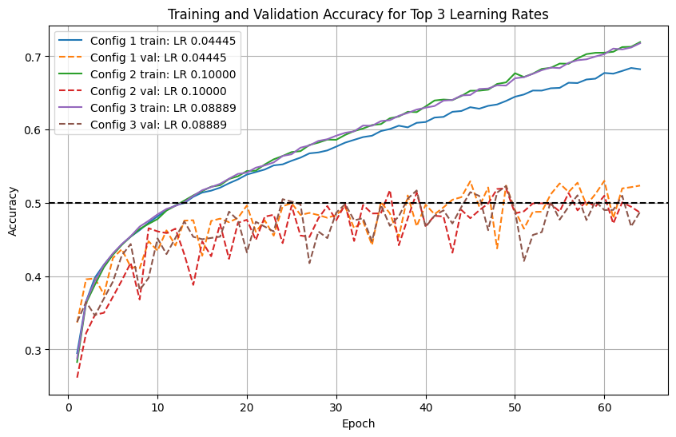
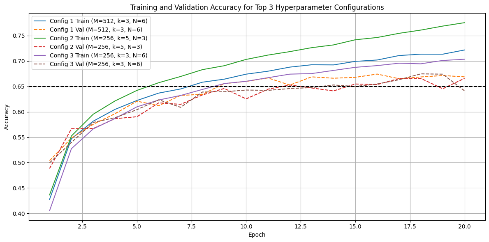

# CIFAR-10 Image Classification

This project explores deep learning architectures for image classification on the CIFAR-10 dataset using PyTorch. The goal is to classify images into one of 10 classes: airplane, automobile, bird, cat, deer, dog, frog, horse, ship, and truck.  

---

## Features

This repository contains a **single Python script** that handles:

1. **Data Loading** – Automatically downloads the CIFAR-10 dataset and prepares training, validation, and test splits.  
2. **Model Definitions** – Includes linear, non-linear (fully connected with ReLU), and convolutional neural network (CNN) models.  
3. **Training and Evaluation** – Trains models using SGD, evaluates on validation and test sets, and calculates accuracy.  
4. **Hyperparameter Search** – Implements random and grid search to find top-performing model configurations.  
5. **Plotting** – Generates plots of training and validation accuracy for the top hyperparameter configurations. 
---
## Skills
- PyTorch deep learning framework  
- Convolutional Neural Networks (CNNs)  
- Fully connected neural networks with ReLU activation  
- Data preprocessing and batching with DataLoader  
- Hyperparameter tuning (random search, grid search)  
- Model evaluation, plotting, and visualization 
--- 
## Results for Top 3 configurations for Different Network Architectures 
*Validation and training accuracy over number of filters, filter size and pooling size*




---
## Customization
Modify the train and parameter_search functions to experiment with different architectures, optimizers, or hyperparameter ranges.

Adjust SAMPLE_DATA for quick testing or full training.
---

## Requirements

- Python 3.8+  
- PyTorch 2.x  
- torchvision  
- matplotlib  
- numpy  
- tqdm  

## Installation
Install the dependencies with:

```bash
pip install torch torchvision matplotlib numpy tqdm

## Project Structure
cifar10_classification/
│
├─ cifar10_classification.py      # Main script (data, models, training, hyperparameter search, plotting)
├─ README.md                      # Project overview-- you're here :)
├─- `figures/`                    # plots of MSE results
└─ data/                          # CIFAR-10 dataset will be downloaded here automatically
